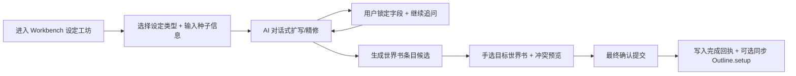

# NovelToST「世界设定协作工坊 + 世界书写回」设计稿（v1.3）

> 版本定位：v1.3 为 **v1.2 中途插入的扩展分支**，用于补足“世界设定协作”能力。
>
> 约束原则：
>
> 1. 不推翻 v1.2 已落地架构（单 Runtime / 单 Pinia / 双挂载策略不变）
>
> 2. 以 Workbench 增量扩展实现，不破坏现有大纲与生成链路
>
> 3. 世界书写入必须经过最终人工确认

---

## 0) 插入背景

当前项目已有：

- 写作流（总纲/细纲）
- 生成执行
- 独立的“TXT 转世界书”流程

缺口在于：

- 缺少“面向世界观搭建”的对话式协作流程
- 缺少“从设定草案 -> 世界书条目候选 -> 人工确认 -> 写回世界书”的一体化闭环

---

## 1) 决策冻结（已确认）

1. **目标世界书手选**
   - 原因：用户可能同时加载多个聊天世界书，不能默认单目标。
2. **冲突默认策略：`append_rename`**
   - 以数据安全优先，避免覆盖已有条目。
3. **允许同步至 Outline.setup**
   - 设定结果可选择性回填到 `setup.characters / worldRules / constraints`。
4. **类型模板策略：4 个可用 + 4 个占位**
   - 可用：角色、势力/组织、地点、规则/力量体系
   - 占位：历史事件、物品/技术、文化习俗、自定义扩展
5. **交互模式：对话式协作**
   - 强调与酒馆使用习惯一致，并增加“预设/角色卡”协作提醒。

---

## 2) 范围定义

### 2.1 纳入范围（v1.3）

- Workbench 新增“设定工坊”子 Tab（写作流内）
- 对话式设定迭代（多轮）
- 结构化草案版本管理与字段锁定
- 世界书条目候选生成
- 冲突预览与手动确认提交
- 提交后可选同步 Outline.setup

### 2.2 暂不纳入（延后）

- 自动切换当前角色卡（仅做提示与引用，不改会话角色）
- 全自动无确认提交
- 复杂多分支协作（多人并发编辑）

---

## 3) 用户流程（核心）



---

## 4) UI 结构调整（Workbench）

## 4.1 写作流子 Tab

由：`总纲 / 细纲`

调整为：`设定工坊 / 总纲 / 细纲`

## 4.2 设定工坊布局

- 左栏：类型模板 + 设定会话列表
- 中栏：对话区（用户与 AI 多轮协作）
- 右栏：结构化草案（字段锁定、版本切换）
- 底栏：世界书候选条目、冲突状态、提交按钮

## 4.3 会话 CRUD（已落地）

会话层已支持完整 CRUD：

- **Create**：创建会话 `createSession(...)`
- **Read**：会话列表展示 + 切换 `setActiveSession(...)`
- **Update**：会话编辑保存 `patchSession(sessionId, { type, title, seed })`
- **Delete**：删除会话 `removeSession(sessionId)`（二次确认）

`WorldbuildingPanel.vue` 已提供稳定测试钩子（用于 UI 自动化/集成测试）：

- `data-worldbuilding-session-edit-title`
- `data-worldbuilding-session-edit-type`
- `data-worldbuilding-session-edit-seed`
- `data-worldbuilding-action="apply-session-edit"`
- `data-worldbuilding-action="reset-session-edit"`
- `data-worldbuilding-action="open-remove-session-confirm"`
- `data-worldbuilding-remove-session-confirm-modal`
- `data-worldbuilding-action="confirm-remove-session"`

删除会话后，提交相关 UI 状态会被清空（`commitPreview / commitReceipt / outlineSyncReceipt`），避免残留脏状态。

## 4.4 协作提示区

进入工坊时展示：

- 当前预设（`getLoadedPresetName()`）
- 当前角色卡（`getCurrentCharacterName()`）
- 推荐提醒（如温度过高、max tokens 过低等）

> 默认行为：先“提醒”，不自动修改预设。

---

## 5) 数据模型（新增 worldbuilding 域）

```ts
type WorldbuildingType =
  | 'character'
  | 'faction'
  | 'location'
  | 'system'
  | 'history_placeholder'
  | 'item_placeholder'
  | 'culture_placeholder'
  | 'custom_placeholder';

type WorldbuildingMessage = {
  id: string;
  role: 'user' | 'assistant' | 'system';
  text: string;
  createdAt: string;
};

type WorldbuildingDraft = {
  name: string;
  aliases: string[];
  summary: string;
  facts: string[];
  constraints: string[];
  relations: Array<{ target: string; relation: string }>;
  extra: Record<string, unknown>;
};

type WorldbuildingDraftVersion = {
  id: string;
  version: number;
  draft: WorldbuildingDraft;
  lockedFields: string[];
  createdAt: string;
};

type WorldbuildingSession = {
  id: string;
  type: WorldbuildingType;
  title: string;
  seed: string;
  messages: WorldbuildingMessage[];
  versions: WorldbuildingDraftVersion[];
  activeVersionId: string | null;
  updatedAt: string;
};

type WorldbookEntryCandidate = {
  id: string;
  category: string;
  name: string;
  keywords: string[];
  content: string;
  strategy: 'constant' | 'selective';
  checked: boolean;
  conflict?: {
    kind: 'none' | 'name' | 'keyword_overlap';
    targetEntryName?: string;
  };
};

type WorldbookCommitMode = 'append_rename' | 'keep_existing' | 'replace_existing' | 'ai_merge';

type WorldbuildingState = {
  sessions: WorldbuildingSession[];
  activeSessionId: string | null;
  candidates: WorldbookEntryCandidate[];
  selectedWorldbookName: string | null;
  commitMode: WorldbookCommitMode; // default: append_rename
  updatedAt: string;
};
```

持久化：

- chat 变量路径：`novelToST.worldbuilding`
- 设计与 `novelToST.outline` 一致，按聊天隔离

---

## 6) AI 协作协议

## 6.1 生成通道

- 默认使用酒馆当前模型/预设通道（与用户当前使用环境一致）
- 每轮请求打包：
  - 当前会话种子
  - 最近若干轮工坊消息
  - 当前草案（含 lockedFields）
  - 任务意图（扩写 / 精修 / 一致性检查 / 生成候选条目）

## 6.2 输出约束

AI 返回建议采用“双通道”结构：

1. 可展示的自然语言回复（给用户）
2. 严格 JSON（给系统解析）

JSON 解析失败时：

- 保留自然语言回复
- 提示“结构化解析失败，可重试”
- 不覆盖当前草案

---

## 7) 世界书提交机制

## 7.1 目标选择

- 下拉列出 `getWorldbookNames()`
- 用户手选提交目标（必选）

## 7.2 冲突策略

默认：`append_rename`

- 同名冲突时自动重命名（如 `name (2)`）
- 保留已有条目不覆盖

扩展策略（后续可开关）：

- `keep_existing`
- `replace_existing`
- `ai_merge`

## 7.3 提交流程

1. 读取目标世界书：`getWorldbook(worldbook_name)`
2. 冲突检测（同名 + 关键词重叠）
3. 渲染提交预览（逐条勾选）
4. 用户确认后调用 `createWorldbookEntries(...)`
5. 返回回执（成功/失败/重命名统计 + 已提交候选映射）

`WorldbookCommitReceipt` 在 v1.3 落地结构中已包含：

```ts
type CommittedWorldbookCandidate = {
  candidateId: string;
  category: string;
  originalName: string;
  resolvedName: string;
  content: string;
};

type WorldbookCommitReceipt = {
  // ...略
  committedEntryNames: string[];
  committedCandidates: CommittedWorldbookCandidate[];
};
```

其中 `committedCandidates` 用于后续 Outline 同步，仅包含“宿主确认成功写入”的候选条目。

---

## 8) 与 Outline 集成

已落地为独立服务：

- `src/novelToST/core/worldbuilding-outline-sync.service.ts`
- `syncCommittedCandidatesToOutlineSetup(candidates)`

同步策略：

1. **输入来源**：`WorldbookCommitReceipt.committedCandidates`
2. **目标字段**（追加去重）：
   - `outline.setup.characters`
   - `outline.setup.worldRules`
   - `outline.setup.constraints`
3. **分类路由（启发式）**：
   - 角色类关键词（如 `角色/人物/主角/character`） -> `characters`
   - 规则类关键词（如 `规则/体系/法则/魔法/system`） -> `worldRules`
   - 约束类关键词（如 `约束/限制/禁忌/constraint`） -> `constraints`
   - 兜底 -> `constraints`
4. **条目格式**：`"${displayName}：${content}"`
5. **去重规则**：比较前执行 `trim + 空白折叠 + 小写化`
6. **写入时机**：仅当 `appendedCount > 0` 才调用 `outlineStore.patchSetup(...)`

UI 交互约束（`WorldbuildingPanel.vue`）：

- 开关：`data-worldbuilding-outline-sync-toggle`
- 回执区：`data-worldbuilding-outline-sync-receipt`
- 提交确认弹窗中展示当前同步状态（开/关）

同步回执结构：

```ts
type OutlineSetupSyncReceipt = {
  totalInputCount: number;
  validInputCount: number;
  appendedCount: number;
  skippedCount: number;
  appendedCountByField: { characters: number; worldRules: number; constraints: number };
};
```

---

## 9) 代码落位（E1~E4 实际）

- `src/novelToST/stores/worldbuilding.store.ts`
- `src/novelToST/composables/useWorldbuildingControl.ts`
- `src/novelToST/composables/useWorldbuildingPersistence.ts`
- `src/novelToST/core/worldbuilding-ai.service.ts`
- `src/novelToST/core/worldbook-commit.service.ts`
- `src/novelToST/core/worldbuilding-outline-sync.service.ts`
- `src/novelToST/ui/workbench/WorldbuildingPanel.vue`

并扩展：

- `src/novelToST/app/workbench.events.ts` 的 `WorkbenchTab`
- `src/novelToST/stores/workbench.store.ts` 的写作子 Tab 计算
- `src/novelToST/ui/workbench/WorkbenchRoot.vue` 的子 Tab 与面板渲染

---

## 10) 分阶段实施（Phase E）

1. **E1：壳 + 状态域 + 持久化**（已完成）
2. **E2：对话式 AI 协作 + 版本/锁定**（已完成）
3. **E3：候选条目 + 冲突预览 + 手选提交目标**（已完成）
4. **E4：写入 API + 回执 + Outline 同步 + 测试补齐 + 文档收口**（已完成）

---

## 11) 测试覆盖（E4 收口）

- `tests/unit/stores/worldbuilding.store.spec.ts`
  - 覆盖：会话 CRUD（含 `patchSession` / `removeSession`）、版本、锁字段、候选状态
- `tests/unit/composables/useWorldbuildingPersistence.spec.ts`
  - 覆盖：chat 变量读写与切聊天回填
- `tests/unit/core/worldbuilding-ai.service.spec.ts`
  - 覆盖：JSON 解析与失败回退
- `tests/unit/core/worldbook-commit.service.spec.ts`
  - 覆盖：`append_rename`、冲突检测、`committedCandidates`
- `tests/unit/core/worldbuilding-outline-sync.service.spec.ts`
  - 覆盖：`outline.setup` 三字段追加去重 + 分类路由
- `tests/unit/ui/workbench.worldbuilding-panel.spec.ts`
  - 覆盖：会话更新/删除交互、提交后 Outline 同步开关/回执
- `tests/integration/ui/workbench.worldbuilding.int.spec.ts`
  - 覆盖：设定工坊完整闭环（创建 -> 候选生成 -> 预览/确认 -> 世界书写入 -> Outline 同步）

> 验证基线：`pnpm typecheck`、`pnpm test:run -- tests/unit`、`pnpm test:run` 均通过。

---

## 12) 操作说明（v1.3 工坊）

1. 在 Workbench 写作流切换到 **设定工坊**。
2. 新建会话后，可直接在“当前会话”区编辑并保存（类型/标题/种子）；删除会话需二次确认。
3. 通过“AI 扩写 / AI 精修 / 一致性检查 / 生成候选条目”完成协作迭代。
4. 在“世界书提交”区手选目标世界书，先看冲突预览，再打开确认弹窗提交。
5. 如需回填 Story Setup，勾选“提交成功后同步到 Outline.setup（追加去重）”。
6. 提交后查看两类回执：
   - 世界书提交回执（成功/重命名/失败）
   - Outline 同步回执（新增/跳过 + 分字段统计）

常用自动化钩子：`data-worldbuilding-action="apply-session-edit"`、`data-worldbuilding-action="confirm-remove-session"`、
`data-worldbuilding-outline-sync-toggle`、`data-worldbuilding-action="confirm-commit"`。
