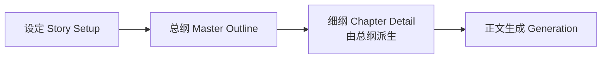

# NovelToST「大纲流 + Workbench」设计稿（v1.2）

> 版本说明：在 v1 草案基础上，合并已确认决策：
>
> 1) 默认“警告降级”
>
> 2) 支持后台加载
>
> 3) v1 暂不把导出/标签提取/世界书并入 Workbench
>
> 4) v1 直接提供 AI 生成大纲/细纲能力
>
> 5) 冻结 Workbench/FAB 挂载策略（主页面根 body + 扩展页 #extensions_settings2）
>
> 6) 2026-03 中途插入任务：新增“世界设定协作工坊 + 世界书写回确认流”，详见 `docs/design/v1.3.md`

---

## 0) 决策冻结（已确认）

1. **默认策略：警告降级（warn_fallback）**
   - 章节无细纲时，不阻断生成；弹出提示并回退旧 `settings.prompt`。
2. **支持后台加载（预加载）**
   - 首屏先轻量初始化，空闲时预挂载 Workbench，点击 FAB 秒开。
3. **Workbench v1 范围收敛**
   - 暂不纳入：导出 / 标签提取 / 世界书（该条仅约束 v1.2 主线）。
   - 以上能力继续保留在现有面板与按钮中。
4. **AI 能力直带**
   - v1 提供 AI 生成总纲、AI 派生细纲、AI 重写单章细纲。
5. **挂载点策略冻结**
   - 扩展页入口继续挂 `#extensions_settings2`。
   - 主页面 FAB + Workbench 挂 Tavern 根 `body`。
   - 通过 `resolveTavernRootBody()` 统一定位，并保留兜底/告警策略。
6. **中途插入任务记录（2026-03）**
   - 在不回改 v1.2 已落地基线的前提下，新增“世界设定协作工坊 + 世界书写回确认流”设计分支。
   - 详细方案单列为 `docs/design/v1.3.md`，并作为 Phase E 扩展实施。

---

## 1) 目标与范围

### 目标

1. 在 Tavern 主页面提供**悬浮按钮（FAB）+ 可展开工作台主面板**。
2. 写作流程重构为：**设定 → 大纲 → 细纲（由大纲派生）→ 正文生成**。
3. 扩展页保留为：**入口 + 高级设置**（不再承载完整主工作流）。
4. 保证“单实例状态”：扩展页与主页面看到的是同一份运行状态和数据。
5. 在不破坏现有生成链路前提下完成增量接入（兼容老工作流）。

### 非目标（v1 不做）

- 不做复杂多人协同、版本分支管理。
- 不做自动剧情评审器/质量打分器。
- 不强制引入复杂拖拽布局（先固定位置+开关）。
- 不在 v1.2 主线中把导出/标签提取/世界书迁入 Workbench（保持现状能力可用；v1.3 另行扩展）。

---

## 2) 产品流程（核心）



### 运行规则

- 生成时按 `currentChapter + 1` 查找对应“细纲”并注入提示词。
- 若章节无细纲：
  - **默认：警告降级**（toast 提示 + 回退旧 prompt）。
  - 可选：严格阻断（高级设置开关，非默认）。
- Outline 功能可开关：关闭时行为与当前版本一致。

### AI 流程（v1）

- `AI 生成总纲`：基于“设定”生成章节段落式总纲。
- `AI 派生细纲`：基于总纲批量生成章级细纲。
- `AI 重写细纲`：针对某一章细纲做局部重写。

---

## 3) UI 设计（Workbench + 扩展页）

## 3.1 主页面 Workbench（悬浮）

- 右下角 FAB（默认显示）。
- FAB 与 Workbench 统一挂载在 Tavern 主页面根 `body` 下的固定定位 Host（`div.novel-to-st-workbench-host`）中。
- Host 内使用 iframe 隔离样式；Workbench 主面板默认不自动展开。
- 点击 FAB 打开主工作台面板（建议右侧抽屉）。
- Workbench v1 仅保留 2 个主 Tab：
  1. **写作流**：设定 / 大纲 / 细纲 + AI 操作按钮
  2. **生成执行**：状态栏 + 控制按钮 + 核心生成参数

## 3.2 扩展页（精简）

仅保留两块：

1. **打开工作台入口**（挂载于 `#extensions_settings2`，点击触发主页面 Workbench 打开）
2. **高级设置**（稳定性、超时、兼容策略等）

## 3.3 后台加载（用户感知优化）

- 首次注入时先初始化 Runtime/Store/持久化（轻量）。
- 使用 `requestIdleCallback`（无则 `setTimeout`）执行 Workbench 隐式预挂载（主页面 Host + iframe + App）。
- FAB 点击优先激活已预加载实例；若预加载未完成则即时挂载兜底。

## 3.4 挂载点解析与兜底（新增）

### 挂载点冻结

- 扩展页入口：`#extensions_settings2`
- 主页面 FAB/Workbench：Tavern 根 `body`

### 根 body 解析函数（建议）

```ts
function resolveTavernRootBody(): HTMLBodyElement {
  const candidates = [
    () => window.parent?.document?.body ?? null,
    () => window.top?.document?.body ?? null,
    () => document.body ?? null,
  ];

  for (const getBody of candidates) {
    try {
      const body = getBody();
      if (body && body.isConnected) {
        return body;
      }
    } catch {
      // cross-origin / sandbox 场景忽略
    }
  }

  throw new Error('[novelToST] 无法定位 Tavern 根 body');
}
```

### 兜底策略

- 根 body 解析异常时记录 warning，并使用 `document.body` 作为最后兜底；
- 主页面 Host 挂载失败不影响扩展页入口与旧按钮链路；
- `ensureWorkbenchHost()` / `mountWorkbench()` / `unmountWorkbench()` 必须幂等（支持重复调用与安全回收）。

---

## 4) 技术架构（关键：单实例状态）

```mermaid
graph TD
I[index.ts] --> R[Runtime Singleton]
R --> P[Pinia 单例]
R --> S[脚本设置持久化(script 变量)]
R --> O[大纲持久化(chat 变量)]
R --> E[扩展页入口 iframe #extensions_settings2]
R --> H[主页面 Host div on Tavern root body]
H --> W[Workbench iframe body]
```

### 核心决策

- **一个 Runtime + 一个 Pinia 实例**，挂两个 UI（扩展页入口 + 主页面工作台）。
- 避免双实例状态漂移。
- 通过 window 自定义事件联动打开/聚焦工作台。
- 主页面注入采用“根 body Host + iframe”模式，避免与 Tavern DOM 样式冲突。
- 通过 `resolveTavernRootBody()` 统一解析 Tavern 根 body（`parent -> top -> self` 顺序）。
- Host 与挂载流程需保证幂等，避免重复注入导致的多实例 DOM 漂移。

---

## 5) 数据模型（v1）

建议新增 `outline` 领域（独立于现有 settings）：

```ts
type OutlineMissingDetailPolicy = 'warn_fallback' | 'strict_block';

type StorySetup = {
  title: string;
  genre: string;
  premise: string;
  tone: string;
  coreConflict: string;
  characters: string[];
  worldRules: string[];
  constraints: string[];
};

type MasterOutlineNode = {
  id: string;
  title: string;
  summary: string;
  chapterStart: number;
  chapterEnd: number;
  turningPoints: string[];
  status: 'draft' | 'approved';
};

type ChapterDetail = {
  chapter: number;
  parentNodeId: string;
  title: string;
  goal: string;
  conflict: string;
  beats: string[];
  mustInclude: string[];
  mustAvoid: string[];
  status: 'draft' | 'approved';
};

type OutlineAIConfig = {
  enabled: boolean;
  provider: 'tavern' | 'custom';
  model: string;
  temperature: number;
};

type OutlineState = {
  enabled: boolean;
  missingDetailPolicy: OutlineMissingDetailPolicy; // 默认 warn_fallback
  setup: StorySetup;
  masterOutline: MasterOutlineNode[];
  detailsByChapter: Record<number, ChapterDetail>;
  ai: OutlineAIConfig;
  updatedAt: string;
};
```

### 持久化策略

- `settings`：继续走 **script 变量**（保持现状）。
- `outline`：走 **chat 变量**（按聊天隔离，避免不同故事串数据）。
- 兼容迁移：旧聊天无 outline 数据时，按默认结构初始化，不影响既有生成。

---

## 6) 生成链路集成点（兼容优先）

在现有链路上做“最小侵入”对接，保持主循环结构不变：

`useGenerationControl.start -> startLoop -> generateSingleChapter -> sendPrompt('/trigger')`

### 新增能力

- 新增 `resolveChapterPrompt(chapter, settings, outlineState)`：
  - 有细纲：拼接“设定摘要 + 对应大纲节点 + 对应细纲 + 原始 prompt”；
  - 无细纲且策略为 `warn_fallback`：返回旧 prompt，并附 warning；
  - 无细纲且策略为 `strict_block`：抛错阻断。

### 接入方式

- `generation.service` 中将章节 prompt 从固定 `settings.prompt` 改为“可解析输入”。
- `useGenerationControl.start` 里接收解析 warning，并在 UI toast 提示“本章已降级到旧 prompt”。
- `pause/resume/stop/reset` 与重试机制保持原样。

### 兼容性结论

- **可以直接在当前工作流上对接**。
- Outline 关闭时，行为与现状一致（等价于无变更）。
- 现有按钮与控制链路可不改或仅做透传增强。

---

## 7) 事件协议（UI 联动）

建议统一事件名（替代零散事件）：

- `novelToST:workbench:open` `{ tab?: 'outline' | 'detail' | 'generation', chapter?: number }`
- `novelToST:workbench:close`
- `novelToST:workbench:focus`

兼容策略：

- 保留旧事件（如 `novelToST:expandWorldbook`）不破坏现有能力。
- 新旧事件可在入口层做映射，避免一次性重构所有调用点。

---

## 8) 分阶段实施（建议 4 个提交）

1. **Phase A：Workbench 壳 + 双挂载 + 单 Pinia + 后台预加载**
   - FAB、展开/收起、扩展页入口联动、空闲预挂载。
   - 增加 `resolveTavernRootBody` 与 Host 管理（主页面 `body` 挂载 + 扩展页 `#extensions_settings2` 挂载）。
2. **Phase B：Outline Store + Chat 持久化 + AI 生成服务**
   - 设定/大纲/细纲 CRUD、校验、AI 生成总纲/细纲。
3. **Phase C：生成链路接入（默认警告降级）**
   - prompt 注入、warn_fallback 默认、strict_block 可选。
4. **Phase D：测试与文档**
   - 单测/集成测补齐，README + docs 同步。

---

## 9) 测试设计（最小必测）

- `outline.store.spec.ts`：派生、校验、状态切换、默认策略。
- `useOutlinePersistence.spec.ts`：chat 变量读写与切聊天回填。
- `workbench.ui.spec.ts`：FAB 开关、主页面根 body 挂载、后台预加载、事件打开指定 tab。
- `mount-target.resolver.spec.ts`：`resolveTavernRootBody()` 在 `parent/top/self` 与异常场景下的解析与兜底。
- `outline-ai.service.spec.ts`：AI 生成总纲/细纲解析与错误处理。
- `generation+outline.int.spec.ts`：
  - 缺细纲 `warn_fallback` 降级；
  - 缺细纲 `strict_block` 阻断；
  - outline 关闭时与旧行为一致。
- `bootstrap.spec.ts`：双挂载生命周期、幂等挂载与清理。

---

## 10) 风险与回滚

- 风险：双挂载与预加载带来生命周期复杂度上升。
- 缓解：统一 Runtime 管理、增加销毁幂等保护、补齐 bootstrap 测试。
- 回滚策略：保留原扩展页完整入口开关，必要时一键退回“单挂载 + 旧面板”模式。

---

## 11) Phase A 实施状态（2026-03）

### 已落地

- 双挂载编排：扩展页 `#extensions_settings2` + 主页面根 `body` Host。
- Runtime/Pinia 单例：扩展页入口与主页面 Workbench 共用同一状态。
- Workbench 事件协议桥接：`open / close / focus`。
- Workbench 壳：FAB 开关、主 Tab（写作流/生成执行）、写作子 Tab（总纲/细纲）占位。
- 扩展页入口：打开工作台按钮 + 高级设置区域。
- 预加载策略：空闲阶段只做 Host/FAB 预热，首次打开时再挂载 iframe App（降低 idle handler 压力）。

### 待续（进入 Phase B/C）

- 写作流实体能力（Outline Store / 细纲编辑 / AI 派生）
- 生成链路与 Outline 的 prompt 解析集成（`warn_fallback` / `strict_block`）
- 进一步性能优化：将 iframe 内应用挂载拆分为更细粒度分段预热

### 回滚开关建议

- 保留 `workbenchEnabled`（或等价构建期开关）以快速退回“仅扩展页入口”路径。
