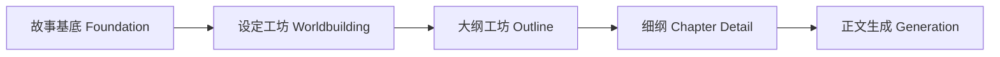

# v3 设计基线：故事基底（Story Foundation）

> 面向项目：NovelToST
> 关联基线：v2（Outline-first）→ v3（Foundation-first）
> 文档状态：**Draft**

---

## 0. 版本说明

本次版本新增「故事基底」页面，定位为整个写作流程的第一步。

设计目标：在不展开剧情结构、不展开世界观百科的前提下，先固定"这是谁的故事、核心驱动力是什么、叙事朝哪个方向走"。

基底不追求完整，而是给后续的世界观设定、大纲、细纲提供一个稳定的约束框架。

### 0.1 决策冻结

1. **独立数据域**：基底作为独立状态域 `StoryFoundation` 存储，不扩展现有 `StorySetup`。
2. **完全替代 StorySetup**：项目未上线，`StorySetup` 将被 `StoryFoundation` 替代。大纲工坊、续写 prompt、世界观工坊均直接读取基底。原 `StorySetup` 类型及相关代码将在迁移完成后移除。
3. **交互模式：对话流 + 表单 + TODO 进度追踪**。
4. **8 个模块固定，预留 extension 接口**。
5. **版本归属：v3**。原 v2.3（细纲工坊等）标记为 v4。

### 0.2 破坏性变更说明

由于项目未上线，本次允许以下破坏性变更：

- 移除 `StorySetup` 类型，全部替换为 `StoryFoundation`。
- `OutlineState.setup` 字段替换为 `OutlineState.foundation`（或直接引用独立 store）。
- 大纲工坊 prompt（`outline-chat.service.ts`、`outline-prompt.service.ts`）中原来读 `setup` 的位置全部改读基底。
- 世界观设定工坊 prompt（`worldbuilding-ai.service.ts`）注入基底上下文。
- 世界观设定工坊的 Outline 同步目标从 `setup.characters / worldRules / constraints` 改为基底对应字段。

---

## 1. 基底的功能定位

基底表单承担四个作用：

### 1.1 固定故事生成方向

防止 LLM 一会儿写成悬疑，一会儿写成成长，一会儿又写言情。

### 1.2 固定人物驱动力

后续无论写大纲还是细纲，都要知道：主角为什么行动、偏向什么选择、什么能打动主角、什么能摧毁主角。

### 1.3 固定叙事气质

同样一个情节，可以写得冷峻、热血、轻喜、阴郁。基底约束"这篇文的气味"。

### 1.4 给世界观和细纲留接口

基底不写世界观细节。基底是"世界观需求说明"，不是"世界观细节总表"。

---

## 2. 产品流程（调整后）



### Tab 顺序

| 顺序 | Tab        | 标识            | 说明         |
| ---- | ---------- | --------------- | ------------ |
| 1    | 📋 故事基底 | `foundation`    | 新增         |
| 2    | 🌍 设定工坊 | `worldbuilding` | 现有         |
| 3    | 📖 大纲工坊 | `outline`       | 现有         |
| 4    | 📝 细纲编辑 | `detail`        | 现有         |
| 5    | ⚙️ 设置     | `llm`           | 现有，右对齐 |


## 3. 基底表单结构（8 个模块）

### 模块 1：作品定位（positioning）

最外层的生成边界，让模型先知道它在写哪一类故事。

| 字段             | 类型     | 必填层 | 说明                                                    |
| ---------------- | -------- | ------ | ------------------------------------------------------- |
| title            | string   | 可选   | 暂定书名                                                |
| genre            | string   | 核心   | 题材类型（如：古风权谋 / 都市悬疑 / 赛博成长）          |
| mainType         | string   | 核心   | 主类型                                                  |
| subType          | string   | 可选   | 副类型                                                  |
| targetExperience | string[] | 可选   | 目标阅读体验关键词，最多 3 个（如：高压悬疑、持续上头） |
| length           | string   | 可选   | 篇幅规格（短篇 / 中篇 / 长篇 / 网文连载）               |
| audience         | string   | 可选   | 受众倾向（女频、男频、泛读者、严肃文学向）              |
| contentIntensity | string[] | 可选   | 内容强度偏好，最多 3 个（如：高反转 / 高情绪 / 高设定） |

### 模块 2：故事核心句（core）

整个基底里最关键的一块，解决"这本书最根本的戏剧张力是什么"。

| 字段          | 类型     | 必填层 | 说明                                          |
| ------------- | -------- | ------ | --------------------------------------------- |
| logline       | string   | 核心   | 一句话故事                                    |
| coreConflict  | string   | 核心   | 核心矛盾                                      |
| coreSuspense  | string   | 可选   | 核心悬念                                      |
| coreSellPoint | string   | 核心   | 核心卖点                                      |
| themeKeywords | string[] | 可选   | 主题关键词，最多 3 个（如：身份、背叛、救赎） |
| emotionalTone | string   | 核心   | 情感底色（如：冷感、炽烈、压抑、荒诞）        |

### 模块 3：主角核心档案（protagonist）

不是人设百科，而是驱动引擎。收集的不是形容词，而是决策倾向。

| 字段           | 类型   | 必填层 | 说明                                           |
| -------------- | ------ | ------ | ---------------------------------------------- |
| name           | string | 可选   | 主角姓名/代称                                  |
| identity       | string | 可选   | 主角身份标签                                   |
| visibleGoal    | string | 核心   | 显性目标（主角自己知道自己想要什么）           |
| deepNeed       | string | 核心   | 深层需求（主角未必意识到，但真正缺失的东西）   |
| coreDesire     | string | 可选   | 核心欲望                                       |
| coreFear       | string | 可选   | 核心恐惧                                       |
| coreFlaw       | string | 核心   | 核心缺陷                                       |
| behaviorStyle  | string | 可选   | 行为风格（如：谨慎型、冲动型、操控型）         |
| moralLeaning   | string | 可选   | 道德倾向（如：守序、功利、灰度现实主义）       |
| mostCaredAbout | string | 可选   | 最在意的人/事                                  |
| bottomLine     | string | 可选   | 不能触碰的底线                                 |
| temptation     | string | 可选   | 最可能被什么诱惑打动                           |
| arcDirection   | string | 可选   | 角色弧光方向（如：从逃避到承担、从冷漠到联结） |

### 模块 4：关键对位角色（keyRelations）

不展开全人物表，只写最重要的"作用角色"。固定谁会持续影响主角。

| 字段                        | 类型   | 必填层 | 说明                                                                         |
| --------------------------- | ------ | ------ | ---------------------------------------------------------------------------- |
| antagonist                  | object | 核心   | 主要对手                                                                     |
| antagonist.name             | string | 核心   | 对手名称/代称                                                                |
| antagonist.goal             | string | 核心   | 对手目标                                                                     |
| antagonist.conflict         | string | 核心   | 与主角的根本冲突                                                             |
| keyCharacters               | array  | 可选   | 关键关系角色列表                                                             |
| keyCharacters[].name        | string | —      | 角色名称                                                                     |
| keyCharacters[].role        | string | —      | 功能标签（推动主线 / 制造冲突 / 提供信息 / 代表另一种价值观 / 承担情感支点） |
| keyCharacters[].relationArc | string | —      | 与主角的关系变化预期（如：敌对→合作、信任→背叛）                             |

---

### 模块 5：核心冲突结构（conflictFramework）

基底和大纲之间的桥梁。细纲写不好，往往不是"写不细"，而是冲突机制没被明确。

| 字段               | 类型     | 必填层 | 说明                                                             |
| ------------------ | -------- | ------ | ---------------------------------------------------------------- |
| mainConflict       | string   | 核心   | 主线冲突                                                         |
| innerConflict      | string   | 可选   | 内部冲突                                                         |
| relationConflict   | string   | 可选   | 关系冲突                                                         |
| externalObstacle   | string   | 可选   | 外部阻力来源（制度、阶层、案件、战争、家庭、组织）               |
| failureCost        | string   | 核心   | 失败代价                                                         |
| timePressure       | string   | 可选   | 时间压力                                                         |
| irreversibleEvents | string[] | 可选   | 不可逆事件预设（一旦发生就无法回头的节点类型）                   |
| escalationPattern  | string   | 可选   | 冲突升级方式（误会升级、信息揭露、资源失衡、身份暴露、阵营变化） |

### 模块 6：叙事约束（narrativeRules）

告诉模型"同样的故事，要用什么叙事习惯来写"。

| 字段              | 类型     | 必填层 | 说明                                                               |
| ----------------- | -------- | ------ | ------------------------------------------------------------------ |
| pov               | string   | 可选   | 叙事视角（第一人称 / 第三人称 / 多视角）                           |
| tenseAndStyle     | string   | 可选   | 叙事时态与风格                                                     |
| languageQuality   | string   | 核心   | 语言气质（克制、锋利、华丽、直白、幽默）                           |
| infoDisclosure    | string   | 可选   | 信息披露方式（早揭示、渐进揭示、强悬念、误导式揭示）               |
| allowExposition   | boolean  | 可选   | 是否允许大篇幅说明性文字                                           |
| plotDriver        | string   | 可选   | 剧情推进偏好（事件驱动 / 人物驱动 / 关系驱动 / 世界驱动）          |
| romanceWeight     | string   | 可选   | 感情线权重                                                         |
| ensembleWeight    | string   | 可选   | 群像权重                                                           |
| emphasisTags      | string[] | 可选   | 强调标签（爽点 / 反转 / 虐点 / 智斗），可多选                      |
| forbiddenPatterns | string[] | 可选   | 禁用套路（不要降智误会、不要脸谱反派、不要机械反转、不要灌水日常） |

### 模块 7：世界需求简报（worldBrief）

基底不写世界设定细节，只写"需要什么样的世界"，作为第二步骤世界观设定的输入。

| 字段                    | 类型     | 必填层 | 说明                                                         |
| ----------------------- | -------- | ------ | ------------------------------------------------------------ |
| worldType               | string   | 可选   | 故事发生需要什么类型的世界（如：高压等级社会、资源稀缺环境） |
| requiredRules           | string[] | 可选   | 必须存在的规则类型（身份限制、力量代价、职业壁垒）           |
| keyScenes               | string[] | 可选   | 需要哪些关键场景资源（学院、法庭、战场、地下黑市）           |
| settingPivots           | string[] | 可选   | 依赖哪些设定支点（记忆可篡改、血统决定地位、AI 能接管身体）  |
| conflictGeneratingRules | string[] | 可选   | 哪些世界规则会直接制造冲突                                   |
| forbiddenSettings       | string[] | 可选   | 哪些设定不能出现                                             |

### 模块 8：终局约束（endgame）

给大纲和细纲做远端约束，提供"远方终点"。

| 字段               | 类型     | 必填层 | 说明                                                       |
| ------------------ | -------- | ------ | ---------------------------------------------------------- |
| overallDirection   | string   | 可选   | 故事总体走向（上升、坠落、循环、救赎、毁灭、开放）         |
| endingType         | string   | 核心   | 预期结局类型（HE / BE / 开放式 / 阶段性胜利 / 苦涩圆满）   |
| protagonistChanges | boolean  | 可选   | 主角最终会不会改变                                         |
| rootProblem        | string   | 可选   | 最终要解决的根问题                                         |
| readerFeeling      | string   | 可选   | 结尾希望读者留下的感受                                     |
| mustResolve        | string[] | 可选   | 哪些东西必须回收（身份谜团、承诺、伏笔、象征物、关系结果） |

---

## 4. 分层结构：核心必填层 + 增强可选层

为了避免用户一上来填太多填崩，表单分两层。

### 4.1 核心必填层（最小可用基底）

最少但足够强的字段集，支撑后续生成：

- positioning.genre（题材类型）
- positioning.mainType（主类型）
- core.logline（一句话故事）
- core.coreSellPoint（核心卖点）
- core.coreConflict（核心矛盾）
- core.emotionalTone（情感底色）
- protagonist.visibleGoal（主角显性目标）
- protagonist.deepNeed（主角深层需求）
- protagonist.coreFlaw（主角核心缺陷）
- keyRelations.antagonist（主要对手：name + goal + conflict）
- conflictFramework.mainConflict（主线冲突）
- conflictFramework.failureCost（失败代价）
- narrativeRules.languageQuality（语言气质）
- endgame.endingType（预期结局方向）

### 4.2 增强可选层

用于提升细纲质量，不强制填写：

- protagonist.behaviorStyle / moralLeaning / arcDirection
- keyRelations.keyCharacters
- conflictFramework.escalationPattern / timePressure
- narrativeRules.infoDisclosure / romanceWeight / forbiddenPatterns
- worldBrief 全部字段
- endgame.readerFeeling / mustResolve

---

## 5. 交互模式

### 5.1 表单 + 对话协作

页面分两个主区域：

- **左侧 / 上方**：对话区。与 AI 协作，AI 可以帮助填充、优化、检查基底各模块。
- **右侧 / 下方**：表单区。8 个模块以折叠面板呈现，每个面板可独立展开编辑。

AI 返回结构化 JSON 时，系统自动将结果合并到表单。解析失败不覆盖表单，只保留自然语言回复。

### 5.2 TODO 进度追踪

基底页面顶部显示一个进度条 + TODO 清单，列出 8 个模块的完成状态：

- ⬜ 未开始（模块内没有任何必填字段被填写）
- 🟡 进行中（部分必填字段已填写）
- ✅ 已完成（全部必填字段已填写）

TODO 清单可以展开查看每个模块的必填字段完成情况。用户也可以手动标记为"已完成"跳过可选字段。

### 5.3 模块级 AI 辅助

每个模块面板右上角提供"AI 帮我想"按钮，针对当前模块进行补全建议。此操作将当前基底已有内容 + 模块上下文发送给 AI，返回该模块的建议填充。

### 5.4 防止"想要一切"

对于列表类字段（如 targetExperience / themeKeywords / contentIntensity），UI 上限制最多选择 3 个，并要求排序。这避免模型生成时各方向互相打架。

---

## 6. 数据模型

### 6.1 类型定义

```ts
// src/novelToST/types/foundation.ts

export type FoundationPositioning = {
  title: string;
  genre: string;
  mainType: string;
  subType: string;
  targetExperience: string[];  // max 3
  length: string;
  audience: string;
  contentIntensity: string[];  // max 3
};

export type FoundationCore = {
  logline: string;
  coreConflict: string;
  coreSuspense: string;
  coreSellPoint: string;
  themeKeywords: string[];  // max 3
  emotionalTone: string;
};

export type FoundationProtagonist = {
  name: string;
  identity: string;
  visibleGoal: string;
  deepNeed: string;
  coreDesire: string;
  coreFear: string;
  coreFlaw: string;
  behaviorStyle: string;
  moralLeaning: string;
  mostCaredAbout: string;
  bottomLine: string;
  temptation: string;
  arcDirection: string;
};

export type FoundationAntagonist = {
  name: string;
  goal: string;
  conflict: string;
};

export type FoundationKeyCharacter = {
  id: string;
  name: string;
  role: string;
  relationArc: string;
};

export type FoundationKeyRelations = {
  antagonist: FoundationAntagonist;
  keyCharacters: FoundationKeyCharacter[];
};

export type FoundationConflictFramework = {
  mainConflict: string;
  innerConflict: string;
  relationConflict: string;
  externalObstacle: string;
  failureCost: string;
  timePressure: string;
  irreversibleEvents: string[];
  escalationPattern: string;
};

export type FoundationNarrativeRules = {
  pov: string;
  tenseAndStyle: string;
  languageQuality: string;
  infoDisclosure: string;
  allowExposition: boolean;
  plotDriver: string;
  romanceWeight: string;
  ensembleWeight: string;
  emphasisTags: string[];
  forbiddenPatterns: string[];
};

export type FoundationWorldBrief = {
  worldType: string;
  requiredRules: string[];
  keyScenes: string[];
  settingPivots: string[];
  conflictGeneratingRules: string[];
  forbiddenSettings: string[];
};

export type FoundationEndgame = {
  overallDirection: string;
  endingType: string;
  protagonistChanges: boolean;
  rootProblem: string;
  readerFeeling: string;
  mustResolve: string[];
};

export type FoundationModuleId =
  | 'positioning'
  | 'core'
  | 'protagonist'
  | 'keyRelations'
  | 'conflictFramework'
  | 'narrativeRules'
  | 'worldBrief'
  | 'endgame';

export type FoundationModuleStatus = 'empty' | 'partial' | 'complete';

export type FoundationExtensionModule = {
  id: string;
  title: string;
  fields: Record<string, unknown>;
};

export type StoryFoundation = {
  positioning: FoundationPositioning;
  core: FoundationCore;
  protagonist: FoundationProtagonist;
  keyRelations: FoundationKeyRelations;
  conflictFramework: FoundationConflictFramework;
  narrativeRules: FoundationNarrativeRules;
  worldBrief: FoundationWorldBrief;
  endgame: FoundationEndgame;
  extensions: FoundationExtensionModule[];
};

export type FoundationMessageRole = 'user' | 'assistant' | 'system';

export type FoundationMessage = {
  id: string;
  role: FoundationMessageRole;
  text: string;
  createdAt: string;
  parseError?: string | null;
  rawResponse?: string;
};

export type FoundationState = {
  foundation: StoryFoundation;
  messages: FoundationMessage[];
  moduleStatuses: Record<FoundationModuleId, FoundationModuleStatus>;
  updatedAt: string;
};
```

### 6.2 Extension 接口

`StoryFoundation.extensions` 是一个数组，用户可以自定义添加额外的表单结构。每个 extension module 包含 `id`、`title` 和自由结构的 `fields`。

UI 层为 extension 提供通用的 JSON 表单编辑器。AI 协作时，extension 内容作为附加上下文注入 prompt。

---

## 7. 持久化

- chat 变量路径：`novelToST.foundation`
- 与 `novelToST.outline` 和 `novelToST.worldbuilding` 一致，按聊天隔离。
- 旧聊天无 foundation 数据时，按默认空结构初始化。

---

## 8. 基底与下游的集成

### 8.1 大纲工坊

`outline-chat.service.ts` 中 `buildOutlineChatPrompts` 当前注入 `buildSetupPromptSection(setup)`，替换为 `buildFoundationPromptSection(foundation)`。

注入内容包括基底全部 8 个模块的摘要（空字段跳过）。

### 8.2 续写 prompt

`outline-prompt.service.ts` 中 `buildSetupSection(setup)` 替换为 `buildFoundationSection(foundation)`。

注入内容更丰富：作品定位、故事核心句、主角档案、关键关系、叙事约束均参与 prompt 拼接。世界需求简报和终局约束视长度酌情注入或摘要。

### 8.3 世界观设定工坊

`worldbuilding-ai.service.ts` 中 `buildCommonPromptSections` 新增基底上下文注入。重点注入模块 7（世界需求简报），使世界观设定工坊知道"需要构建什么样的世界"。

### 8.4 Outline 同步

`worldbuilding-outline-sync.service.ts` 当前向 `outline.setup.characters / worldRules / constraints` 追加。替换为向基底对应字段追加：

- 角色类 → `protagonist` 或 `keyRelations.keyCharacters`
- 规则类 → `worldBrief.requiredRules`
- 约束类 → `worldBrief.forbiddenSettings` 或 `narrativeRules.forbiddenPatterns`

具体路由规则在实施时细化。

### 8.5 Mention 引用

在 Outline Chat 和 Worldbuilding 的 `@` 引用体系中，新增 `foundation` mention kind。用户可以在大纲工坊或世界观工坊中通过 `@基底` 引用当前基底摘要。

---

## 9. AI 协作协议

### 9.1 对话式协作

基底页面的对话区复用现有 LLM 通道（与世界观工坊、大纲工坊一致）。

每轮请求打包：

- 当前基底全量状态
- 最近若干轮对话消息
- 用户本轮指令
- 目标模块（如用户点击某模块的"AI 帮我想"，则限定模块范围）

### 9.2 输出协议

AI 返回双通道结构：

1. 自然语言回复（给用户看）
2. JSON code block（给系统解析）

JSON 结构：

```json
{
  "assistantReply": "本轮我帮你补全了主角核心档案中的行为风格和弧光方向。",
  "foundationPatch": {
    "protagonist": {
      "behaviorStyle": "谨慎型，遇到压力时倾向先收集信息再行动",
      "arcDirection": "从过度谨慎导致错失良机，到学会在不确定中果断出手"
    }
  }
}
```

`foundationPatch` 采用 partial deep merge 语义：只包含需要修改的字段，未提及的字段保持不变。

解析失败时：保留自然语言回复，不覆盖表单，提示用户可重试。

### 9.3 基底设计约束提醒

基底 AI 协作 prompt 中显式包含以下约束提醒：

1. 不要只收集形容词，要收集决策倾向。
2. 主题要具体，不要空泛（如"爱与和平"）。
3. 不要在基底阶段写世界观细节，只写世界需求。
4. 列表类字段（targetExperience / themeKeywords / contentIntensity）最多 3 个，要求排序。

---

## 10. UI 结构

### 10.1 FoundationPanel 主面板

```txt

┌─────────────────────────────────────────────────────┐
│  📋 故事基底                              ❓ 帮助    │
├─────────────────────────────────────────────────────┤
│  ┌─── TODO 进度条 ────────────────────────────────┐ │
│  │ ■■■■□□□□  3/8 模块已完成                       │ │
│  └────────────────────────────────────────────────┘ │
│                                                     │
│  ┌──── 对话区 ────────┐  ┌──── 表单区 ──────────┐  │
│  │                    │  │ ▼ 01 作品定位    ✅  │  │
│  │  [user] ...        │  │ ▼ 02 故事核心句  🟡  │  │
│  │  [assistant] ...   │  │ ▶ 03 主角核心档案 ⬜  │  │
│  │  [user] ...        │  │ ▶ 04 关键对位角色 ⬜  │  │
│  │                    │  │ ▶ 05 核心冲突结构 ⬜  │  │
│  │                    │  │ ▶ 06 叙事约束    ⬜  │  │
│  │                    │  │ ▶ 07 世界需求简报 ⬜  │  │
│  │ ┌──────────────┐   │  │ ▶ 08 终局约束    ⬜  │  │
│  │ │ 输入框 + 发送 │   │  │                     │  │
│  │ └──────────────┘   │  │ [+ 添加扩展模块]    │  │
│  └────────────────────┘  └─────────────────────┘  │
└─────────────────────────────────────────────────────┘
```

### 10.2 响应式布局

- 宽屏（≥1024px）：左右双栏布局（对话区 | 表单区）
- 窄屏：上下单栏布局（表单区在上，对话区在下，可折叠切换）

### 10.3 模块面板

每个模块面板包含：

- 折叠/展开切换
- 模块标题 + 完成状态标记
- 表单字段（必填字段用 `*` 标记）
- 右上角"AI 帮我想"按钮
- 底部"标记为已完成"复选框

---

## 11. 代码落位（预估）

### 新增文件

- `src/novelToST/types/foundation.ts` — 类型定义
- `src/novelToST/stores/foundation.store.ts` — Pinia store
- `src/novelToST/stores/foundation/` — store 内部结构（schemas / normalize / state / slices）
- `src/novelToST/composables/useFoundationControl.ts` — AI 协作逻辑
- `src/novelToST/composables/useFoundationPersistence.ts` — chat 变量持久化
- `src/novelToST/core/foundation-ai.service.ts` — AI prompt 构建与解析
- `src/novelToST/core/foundation-prompt.service.ts` — 基底→prompt 渲染（供大纲/续写/世界观引用）
- `src/novelToST/ui/workbench/FoundationPanel.vue` — 主面板
- `src/novelToST/ui/workbench/foundation-panel/` — 子组件目录
  - `FoundationModulePanel.vue` — 通用模块折叠面板
  - `FoundationProgressBar.vue` — TODO 进度条
  - `FoundationChatStep.vue` — 对话区
  - `FoundationExtensionEditor.vue` — 扩展模块编辑器

### 改动文件

- `src/novelToST/app/workbench.events.ts` — WorkbenchTab 新增 `'foundation'`
- `src/novelToST/stores/workbench.store.ts` — writingTab 新增 `'foundation'`，默认 tab 改为 `'foundation'`
- `src/novelToST/ui/workbench/WorkbenchRoot.vue` — 新增 tab 按钮和面板渲染
- `src/novelToST/core/outline-chat.service.ts` — setup prompt 替换为 foundation prompt
- `src/novelToST/core/outline-prompt.service.ts` — setup section 替换为 foundation section
- `src/novelToST/core/worldbuilding-ai.service.ts` — 注入基底上下文
- `src/novelToST/core/worldbuilding-outline-sync.service.ts` — 同步目标从 setup 改为 foundation
- `src/novelToST/core/outline-mention.service.ts` — 新增 foundation mention provider
- `src/novelToST/types/outline.ts` — OutlineMentionKind 新增 `'foundation'`
- `src/novelToST/stores/outline/core/outline.schemas.ts` — mention kind schema 更新

### 移除文件/类型（迁移完成后）

- `StorySetup` 类型（`types/outline.ts` 中）
- `StorySetupSchema`（`outline.schemas.ts` 中）
- `OutlineState.setup` 字段
- `outline.store-facade.ts` 中 setup 相关 ref 和 slice
- `setup.slice.ts` 中 `patchSetup` 方法

---

## 12. 分阶段实施

### Phase V3-A：数据层 + 持久化

- `v3-a1` 类型定义（`types/foundation.ts`）
- `v3-a2` Zod schemas + normalize
- `v3-a3` Foundation store（CRUD + hydrate + snapshot）
- `v3-a4` Foundation persistence（chat 变量读写 + 切聊天回填）
- `v3-a5` 数据层单测

### Phase V3-B：AI 协作服务

- `v3-b1` `foundation-ai.service.ts`（prompt 构建 + JSON 解析 + partial deep merge）
- `v3-b2` `useFoundationControl.ts`（对话协作 + 模块级 AI 辅助）
- `v3-b3` 服务层单测

### Phase V3-C：UI

- `v3-c1` `WorkbenchTab` 扩展 + tab 注册
- `v3-c2` `FoundationPanel.vue` + 子组件
- `v3-c3` 进度条 + TODO 清单
- `v3-c4` 对话区 + 表单区
- `v3-c5` 扩展模块编辑器
- `v3-c6` UI 测试

### Phase V3-D：下游集成

- `v3-d1` `foundation-prompt.service.ts`（基底→prompt 渲染）
- `v3-d2` 大纲工坊 prompt 集成（替换 setup）
- `v3-d3` 续写 prompt 集成（替换 setup section）
- `v3-d4` 世界观工坊 prompt 集成
- `v3-d5` Outline 同步目标迁移
- `v3-d6` Mention 引用扩展
- `v3-d7` 集成测试

### Phase V3-E：清理 + 文档

- `v3-e1` 移除 StorySetup 类型及相关代码
- `v3-e2` 迁移兼容处理（旧数据自动转换）
- `v3-e3` 测试补齐 + 回归
- `v3-e4` 设计文档收口

---

## 13. 测试覆盖（预估）

- `tests/unit/stores/foundation.store.spec.ts` — store CRUD、hydrate、snapshot
- `tests/unit/composables/useFoundationPersistence.spec.ts` — chat 变量读写
- `tests/unit/composables/useFoundationControl.spec.ts` — AI 协作逻辑
- `tests/unit/core/foundation-ai.service.spec.ts` — prompt 构建、JSON 解析、partial merge
- `tests/unit/core/foundation-prompt.service.spec.ts` — 基底→prompt 渲染
- `tests/unit/ui/workbench.foundation-panel.spec.ts` — 面板交互
- `tests/integration/core/generation+foundation.int.spec.ts` — 续写集成
- 现有 outline / worldbuilding 测试回归

---

## 14. 风险与缓解

### 风险 1：基底字段量大，用户填写门槛高

缓解：核心必填层仅约 14 个字段；TODO 进度条引导；每个模块提供 AI 辅助填充。

### 风险 2：基底替代 StorySetup 带来大量改动

缓解：分阶段实施，先新增后替换；Phase V3-E 集中清理；项目未上线无兼容包袱。

### 风险 3：基底 prompt 注入过长

缓解：`foundation-prompt.service.ts` 中实现智能摘要策略：空字段跳过、可选字段按优先级截断、设定总长度上限。

### 风险 4：扩展模块自由结构难以有效注入 prompt

缓解：扩展模块 prompt 注入采用 JSON stringify + 长度限制，不做复杂语义解析。后续版本可增强。
